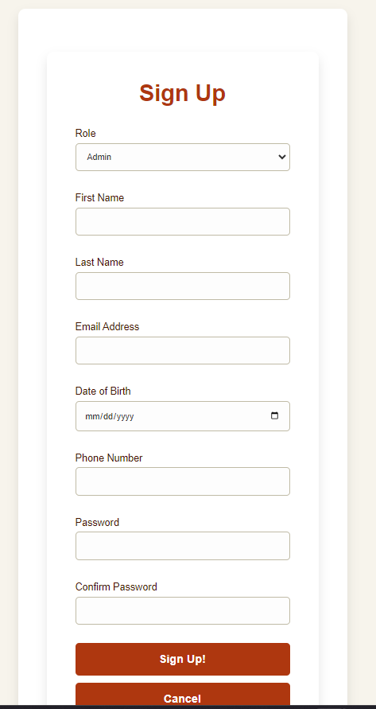
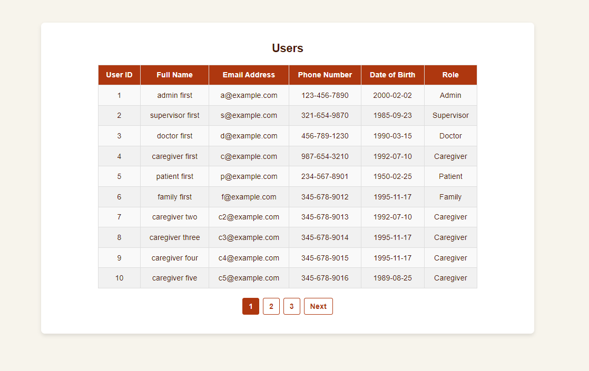
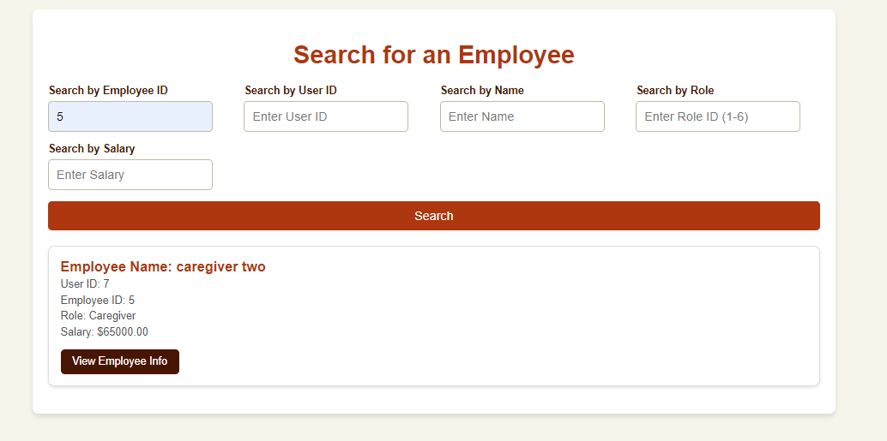
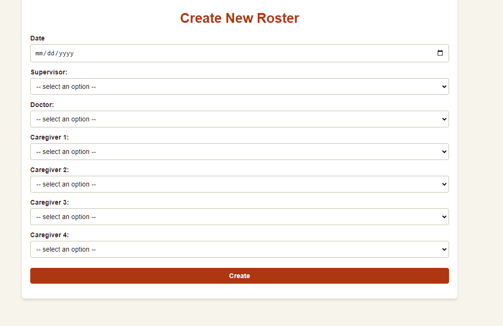

# Hemlock Village Website  

## Overview  
Hemlock Village is a web application designed as our final project, built to manage an assisted living facility. The platform provides role-based access for different healthcare professionals, allowing administrators, doctors, nurses, and staff to log in and access specific features tailored to their roles. Users can register, manage appointments, search for patients or employees, and navigate an organized dashboard to streamline daily operations.  

### **Technologies Used**  
- **Backend:** Laravel (PHP Framework)  
- **Server:** XAMPP  
- **Database Management:** phpMyAdmin (MySQL)  
- **Frontend:** HTML, CSS, JavaScript, PHP  

---

## Website Images  

### **Homepage**  
  
The homepage serves as the entry point to Hemlock Village. It provides an intuitive interface for users to navigate and access essential features.  

### **About Page**  
  
This page contains information about Hemlock Village, including its purpose and key features. It helps users understand the platform before logging in.  

### **Signup Page**  
  
The signup page allows new users to create an account. It features role-based registration to ensure proper access control.  

---

## Features  

### **User Dashboard**  
  
The user dashboard provides an organized view of all available actions, including patient management, scheduling, and system analytics.  

### **Mobile Views**  
Our platform is fully responsive and accessible across various devices. Below are mobile-friendly views for different functionalities.  

#### **Patient Search**  
  
A searchable database where users can find and manage patient records efficiently.  

#### **Employee Search**  
  
Allows administrators to search and manage employee profiles with ease.  

#### **Registration Approval**  
  
Admin panel for approving or rejecting new user registrations based on verification.  

#### **Sidebar Navigation**  
  
A collapsible sidebar providing quick access to essential sections of the application.  

#### **Role Creation**  
  
An admin feature that allows the creation and assignment of user roles with specific permissions.  

#### **New Roster Management**  
  
A scheduling tool for assigning employees to shifts and managing availability.  

---

📁 **All images are stored in the `/images` folder within this repository.**  
